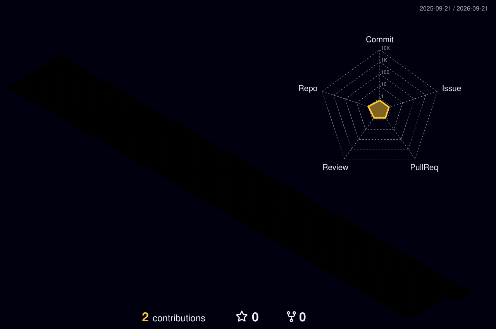

<div align="center">

<a href="https://github.com/shivbhardwaj009">

</a>

<br>

<p>
<a href="https://www.linkedin.com/in/shivbhardwaj009">

</a>
<a href="mailto:shivbhardwaj009@gmail.com">

</a>
<a href="https://www.airavatxdr.in/">

</a>
</p>

<br>


</div>

<br>

---

## About Me

I'm **Shiv Bhardwaj**, a 3rd-year **B.Tech AI & Data Science** student at VIPS Delhi and a **Software Engineer Intern @ 7rd.ai**.

I build systems at the intersection of **AI/ML, LLMs, backend engineering, and real-world products**.

Currently working on:

* 🛰️ Autonomous drone-defense systems
* 🧠 LLM + RAG pipelines
* 🤖 Production AI agents
* ⚙️ Full-stack systems and infrastructure
* 🔬 Applied AI/ML for real-world problems

> **I don't just experiment with AI — I build systems that ship.**

---

## 🚀 Currently Building

```text
┌─────────────────────────────────────────────────────────────────┐
│                         CURRENT FOCUS                            │
├─────────────────────────────────────────────────────────────────┤
│                                                                 │
│  LLM Systems        →  RAG · Agents · AI Pipelines              │
│  AI/ML              →  NLP · Anomaly Detection · Vision AI     │
│  Backend            →  FastAPI · Python · Production APIs      │
│  Full-Stack         →  React · Next.js · Electron · TypeScript │
│  Systems            →  Linux · Docker · AWS · Git              │
│  Hardware           →  ESP32 · Embedded C/C++                   │
│                                                                 │
└─────────────────────────────────────────────────────────────────┘
```

### Software Engineer Intern — 7rd.ai

Working on an autonomous drone-defense platform involving:

* Windows-native ground control software
* Electron + React + TypeScript
* Vision AI
* Autonomous navigation
* Electronic-warfare-resilient systems
* AI-powered operational tooling

Also contributing to production AI infrastructure, including an autonomous agent deployed on VPS infrastructure that reduced manual operational work by approximately **40%**.

---

# 🏆 Recognition

<div align="center">

| Achievement                                |         Result         |
| :----------------------------------------- | :--------------------: |
| 🇮🇳 **India Innovates 2026**              |    National Finalist   |
| 🚀 **Samsung Solve for Tomorrow 2025**     | Top 10 / 20,000+ teams |
| 🥇 **Supernova Hackathon — GL Bajaj 2025** |        1st Place       |

</div>

---

# 🧩 Featured Projects

<table>
<tr>

<td width="50%" valign="top">

## 🔐 AIRAVAT XDR

### Autonomous AI Cyber Defense Platform

**National Finalist — India Innovates 2026**

Real-time cyber-defense platform combining:

* Isolation Forest anomaly detection
* NLP phishing classification
* Risk-score fusion
* FastAPI backend
* React dashboard

**Impact**

`<2s` response latency
`<5%` reported false-positive rate

**Stack**

`Python` `FastAPI` `React` `Scikit-learn` `NLP`

[Repository →](https://github.com/shivbhardwaj009/XDR_hack)
[Live System →](https://www.airavatxdr.in/)

</td>

<td width="50%" valign="top">

## 🤖 SAMARTH-AI

### Government Taxonomy Classification

Full-stack NLP system mapping natural-language product descriptions to **500+ government taxonomy categories**.

**Impact**

`80%` classification accuracy
`70%` reduction in manual effort
`10+ min → <1 sec` processing time

**Stack**

`Python` `FastAPI` `React` `NLP` `ML`

</td>

</tr>

<tr>

<td width="50%" valign="top">

## 📒 NoteNetra

### Offline IoT Cash Tracking

ESP32-powered system designed to digitize informal cash transactions and convert shopkeeper ledger activity into structured credit data.

Validated with real shopkeepers.

**Impact**

`1,000+` daily cash transactions targeted

**Recognition**

Top 10 — Samsung Solve for Tomorrow 2025

**Stack**

`ESP32` `C++` `Python` `IoT`

[Repository →](https://github.com/shivbhardwaj009/Note)

</td>

<td width="50%" valign="top">

## 🎙️ Voice-Based AI Caller

### Autonomous Business Calling Agent

An intelligent voice-based AI bot built specifically for business communications. It can autonomously handle calls, engage with clients naturally, and process business workflows during the conversation.

**Features**

* Natural conversational flow
* Low-latency voice processing
* Dynamic context switching
* Business logic integration

**Stack**

`Python` `LLMs` `Speech-to-Text` `Text-to-Speech` `FastAPI`

</td>

</tr>
</table>

---

# 🧠 Engineering Interests

I'm particularly interested in the layer **between an AI model and a production system**.

```text
                    ┌──────────────────────┐
                    │       USER / API     │
                    └──────────┬───────────┘
                               │
                               ▼
                    ┌──────────────────────┐
                    │    AI APPLICATION    │
                    │                      │
                    │  LLM · RAG · Agents  │
                    └──────────┬───────────┘
                               │
                               ▼
                    ┌──────────────────────┐
                    │    SYSTEMS LAYER     │
                    │                      │
                    │ APIs · Workers · DB  │
                    │ Docker · Linux · AWS │
                    └──────────┬───────────┘
                               │
                               ▼
                    ┌──────────────────────┐
                    │      REAL WORLD      │
                    │                      │
                    │ Users · Devices      │
                    │ Sensors · Operations │
                    └──────────────────────┘
```

### Areas I'm actively exploring

* LLM application architecture
* Retrieval-Augmented Generation
* Autonomous AI agents
* AI evaluation and reliability
* NLP systems
* Computer vision
* Production APIs
* Cloud infrastructure
* Distributed systems
* Edge AI
* Embedded systems
* Developer tooling

---

# 🛠️ Tech Stack

### Languages

<p>


</p>

### AI / ML / LLM

<p>


</p>

### Full-Stack & Infrastructure

<p>


</p>

### Hardware / IoT

<p>


</p>

---

# 📊 GitHub Activity

<div align="center">



<br><br>

### 🔥 Contribution Streak


<br><br>

<b>Building consistently. Learning continuously. Shipping deliberately.</b>

</div>

---

# 📈 Contribution Journey

```text
2024
 │
 ├── Started building
 ├── Programming fundamentals
 └── First serious projects
        │
        ▼
2025
 │
 ├── AI/ML projects
 ├── Hackathons
 ├── Samsung Solve for Tomorrow
 ├── Supernova Hackathon — 1st Place
 └── Real-world product experimentation
        │
        ▼
2026
 │
 ├── Software Engineering Internship @ 7rd.ai
 ├── India Innovates — National Finalist
 ├── LLM + RAG systems
 ├── Autonomous AI agents
 └── Production AI infrastructure
        │
        ▼
     NEXT →
     Open Source
     Systems Engineering
     Research
     Production AI
```

---

# 📚 Learning in 2026

```text
2026
 │
 ├── LLM Engineering
 │   ├── RAG architectures
 │   ├── Agentic workflows
 │   ├── AI evaluation
 │   └── Production AI
 │
 ├── Systems Engineering
 │   ├── Linux
 │   ├── Docker
 │   ├── Cloud infrastructure
 │   └── Distributed systems
 │
 └── Applied AI
     ├── Computer Vision
     ├── NLP
     ├── Edge AI
     └── Autonomous Systems
```

I want my GitHub to reflect **what I can build**, not simply what technologies I have touched.

---

# 🎯 2026 Goals

```text
[✓] Ship production AI systems
[✓] Work on autonomous systems
[✓] Build and deploy LLM applications
[✓] Reach national-level competitions

[ ] Deepen systems & distributed engineering
[ ] Contribute meaningfully to open source
[ ] Publish technical work
[ ] Build a useful AI product from 0 → 1
```

---

<div align="center">

## Let's build something meaningful.

**AI/ML Internships · Software Engineering Internships · Research Collaborations**

<br>

<a href="https://www.linkedin.com/in/shivbhardwaj009">

</a>

<a href="mailto:shivbhardwaj009@gmail.com">

</a>

<br><br>

<sub>AI systems • software engineering • autonomous systems</sub>
<br><br>

<i>"Don't just learn — build something real."</i>

<br><br>


</div>
